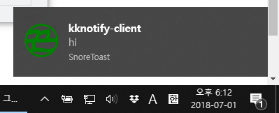

kknotify-client
======

*Run script and watch youtube!*

Simple notification client for
[kknotify-server](https://github.com/kkeundotnet/kknotify-server)

******

In the near future, ~~I will change the language~~ (I will not.
Bother you.), because

1.  it doesn't listen `Ctrl+c`, (I don't know why)
2.  it has no functions for closing socket immediately, (I don't know
    why)

How to run
------

1.  Run
    [kknotify-server](https://github.com/kkeundotnet/kknotify-server)
    on your server.

2.  Run kknotify-client:

    ```
    $ git clone https://github.com/kkeundotnet/kknotify-client
    $ cd kknotify-client
    $ vi kknotify-client.js    # set host, port
    $ npm install
    $ npm run kknotify-client
    ```

3.  Send a notification in the server.

BAAM!  Enjoy!



******

License note: This program is distributed with the public domain.
